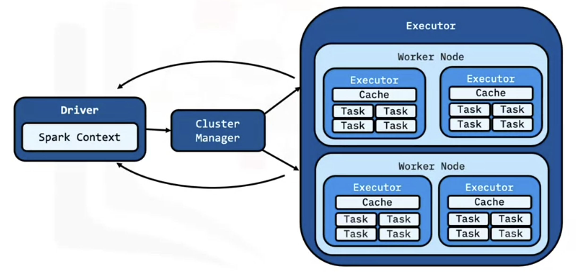

# Scale out / Data Parallelism in Apache Spark

## Apache Spark Components

#### 1. Data Storage
- Datasets load from data storage into memory
- Any Hadoop compatible data source is acceptable

#### 2. Compute Interface 
- Spark has API interface in Python, Scala, Java

#### 3. Cluster Management Framework

- Handles distributed computing aspect of Spark
- Standalone, Mesos, YARN, and Kubernetes
- Essential for scaling big data

## Spark Core

- Is a base engine
- Is fault tolerant
- Performs large scale parallel and distributed data processing
- Manages memory
- Schedules tasks
- Houses APIs that define RDDs
- Contains a distributed collection of elements that are parallelized across the cluster

## Scaling Big Data in Spark

- Spark Application consists of driver program and executor program
- Executor programs run on worker nodes
- Spark can start additional processes on a worker node if there is enough memory and core is available
- Similarly, executors can also take multiple cores for multithreaded calculations 
- Spark distibutes RDDs among executors
- Communication occurs among the driver and executors 
- The driver contains the Spark jobs that the application needs to run and splits the jobs into tasks submitted to the executors
- The driver receives the task results when the executors complete the tasks
- We can add additional worker nodes to scale big data processing increamentally.    